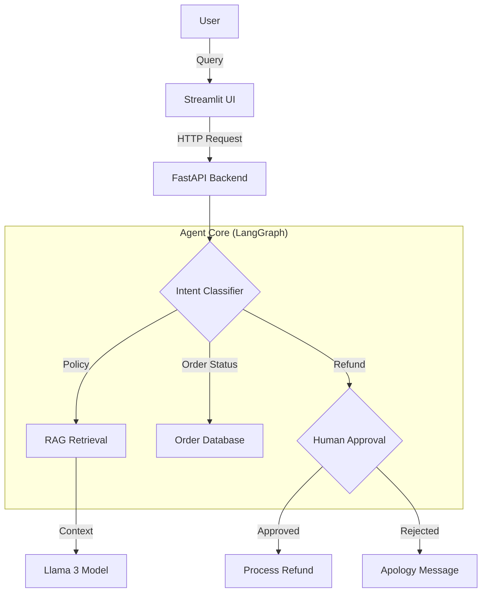

# 🤖 Agentic Customer Support AI

[](https://www.python.org/)
[](https://fastapi.tiangolo.com/)
[](https://www.langchain.com/)
[](https://www.docker.com/)
[](https://opentelemetry.io/)

> **A production-grade, autonomous customer support agent built with LangGraph, RAG, and Human-in-the-Loop workflows.**

---

## 📖 Overview

This project implements an **intelligent customer support agent** capable of handling complex user queries autonomously while knowing when to escalate to a human. Unlike simple chatbots, this agent uses a **Stateful Graph Architecture** (LangGraph) to manage conversation flow, allowing it to:

1.  **Classify Intents**: Distinguish between Policy questions, Order tracking, and Refund requests.
2.  **Retrieve Knowledge (RAG)**: Dynamically search through company policy documents (PDFs) to provide accurate answers using Vector Search (ChromaDB).
3.  **Execute Tools**: securely access order databases to fetch real-time shipping status.
4.  **Human-in-the-Loop**: Pause execution and request human approval for sensitive actions like processing refunds.
5.  **Maintain State**: Remember context across the conversation (e.g., "Where is my order?" -> "It arrives tomorrow" -> "Can I return *it*?").

---

## 🚀 Key Features

*   **🧠 State Machine Architecture**: Built on **LangGraph** for predictable, controllable agent workflows.
*   **📚 RAG (Retrieval-Augmented Generation)**: Uses **ChromaDB** to embed and retrieve relevant policy chunks, ensuring answers are grounded in fact, not hallucinations.
*   **📡 Production-Ready Backend**: **FastAPI** service with structured logging, Pydantic validation, and dependency injection.
*   **🐳 Fully Containerized**: **Docker Compose** setup for one-command deployment (Database + Backend + Frontend).
*   **🔭 Observability**: Integrated with **OpenTelemetry** for tracing requests and debugging latency.
*   **🛡️ Robust Error Handling**: Graceful degradation, retry logic, and user-friendly error messages.
*   **🧪 Tested**: Comprehensive unit tests using **pytest**.

---

## 🛠️ Tech Stack

### Core AI & Logic
*   **LangChain / LangGraph**: Agent orchestration and state management.
*   **Ollama (Llama 3)**: Local LLM inference (can be swapped for OpenAI/Anthropic).
*   **ChromaDB**: Vector store for RAG.

### Backend & API
*   **FastAPI**: High-performance async REST API.
*   **Pydantic**: Data validation and settings management.
*   **Uvicorn**: ASGI server.

### Frontend
*   **Streamlit**: Interactive chat interface for demonstration and testing.

### DevOps & Tooling
*   **Docker**: Containerization.
*   **GitHub Actions**: CI pipeline for automated testing and linting.
*   **Ruff**: Lightning-fast Python linter and formatter.
*   **OpenTelemetry**: Distributed tracing.

---

## 🏗️ Architecture



---

## � Getting Started

### Prerequisites
*   [Docker Desktop](https://www.docker.com/products/docker-desktop/) installed.
*   [Ollama](https://ollama.com/) installed and running (`ollama serve`).

### Quick Start (Docker)

1.  **Clone the repository:**
    ```bash
    git clone https://github.com/yourusername/agentic-customer-support.git
    cd agentic-customer-support
    ```

2.  **Run the application:**
    ```bash
    docker compose up --build
    ```

3.  **Access the App:**
    *   **Frontend**: [http://localhost:8501](http://localhost:8501)
    *   **API Documentation**: [http://localhost:8070/docs](http://localhost:8070/docs)

*For manual setup instructions (without Docker), please refer to [RUN_GUIDE.md](./RUN_GUIDE.md).*

---

## 📂 Project Structure

```text
├── .github/workflows/   # CI/CD Pipelines
├── app/                 # Backend Source Code
│   ├── api/             # FastAPI Routes
│   ├── rag/             # RAG Logic (Embeddings, Retrieval)
│   ├── state/           # LangGraph State Definitions
│   ├── tools/           # Custom Tools (Order Lookup, etc.)
│   ├── config.py        # Environment Configuration
│   └── main.py          # App Entrypoint
├── data/                # Data storage (Policies, Vector DB)
├── tests/               # Unit & Integration Tests
├── ui/                  # Streamlit Frontend
├── Dockerfile           # Backend Container Config
├── docker-compose.yml   # Multi-container Orchestration
└── requirements.txt     # Python Dependencies
```

---

## � Future Improvements

*   **PostgreSQL Persistence**: Migrate state storage from SQLite to Postgres for high availability.
*   **Auth0 Integration**: User authentication for the frontend.
*   **Model Fine-tuning**: Fine-tune a specific Llama adapter for customer support tone.
*   **Kubernetes Helm Chart**: For scalable cloud deployment.

---

**Author**: Gaurav Sonawane
